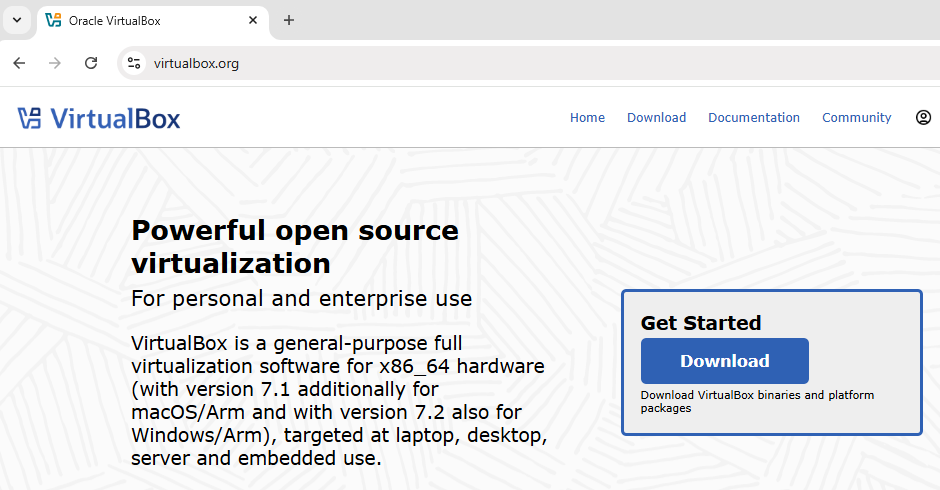
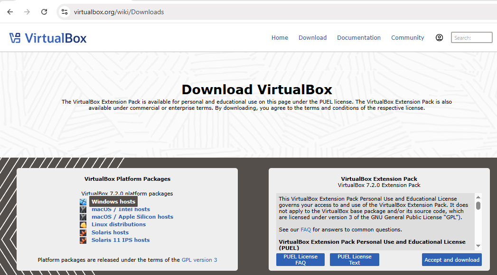
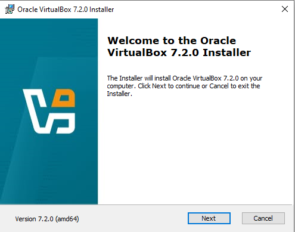
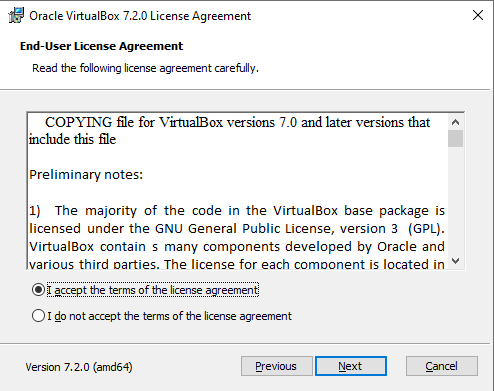
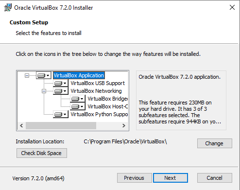
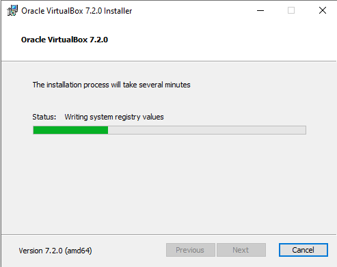

[Voltar para o início](./README.md)

## Módulo 2 – Instalação e Configuração Inicial

🎯 Objetivo
<p align="justify">Guiar o aluno na instalação do VirtualBox e na criação do ambiente básico para executar máquinas virtuais.</p>

### 2.1 Requisitos

<p align="justify">Antes de instalar o VirtualBox, é importante verificar se seu computador atende aos requisitos mínimos para executar máquinas virtuais de forma satisfatória:</p>

- **Sistema Operacional Hospedeiro:** <p align="justify">Windows 8 ou superior, macOS 10.13 ou superior, distribuições Linux modernas ou Solaris.</p>
- **Processador:** <p align="justify">Arquitetura x86 de 64 bits, com suporte a virtualização por hardware (Intel VT-x ou AMD-V) ativada na BIOS/UEFI.</p>
- **Memória RAM:** <p align="justify">Mínimo de 4 GB (o ideal é ter 8 GB ou mais para trabalhar com várias VMs).</p>
- **Armazenamento:** <p align="justify">Espaço livre suficiente para armazenar discos virtuais e snapshots (mínimo recomendado: 20 GB livres).</p>
- **Conexão com a Internet:** <p align="justify">Necessária para baixar o instalador e eventuais pacotes de extensão.</p>

> <p align="justify">💡Dica: Caso sua CPU tenha suporte a virtualização, mas ela esteja desativada, será necessário habilitar a função na BIOS/UEFI antes de prosseguir.</p>

### 2.2 Baixando o VirtualBox

<p align="justify">O VirtualBox pode ser baixado diretamente do site oficial da Oracle:</p>

1.  Acesse: https://www.virtualbox.org



2.  No menu lateral, clique em **Downloads**.
3.  Escolha o pacote adequado ao seu sistema operacional hospedeiro:

    -   **Windows hosts**
    -   **macOS hosts**
    -   **Linux distributions**

4.  (Opcional) Baixe também o **Extension Pack**, que adiciona recursos como suporte a USB 2.0/3.0, inicialização via PXE e criptografia de disco.



> [!TIP]
> <p align="justify">Sempre utilize a versão mais recente, pois ela contém correções de segurança e melhorias de desempenho.</p>

### 2.3 Instalando o VirtualBox

<p align="justify">O processo de instalação é simples, mas varia levemente conforme o sistema hospedeiro.</p>

**No Windows:**

-   Execute o instalador .exe baixado.



-   Aceite os termos de licença.



-   Escolha os componentes a instalar (mantenha as opções padrão).
-   Defina o local de instalação.



-   Clique em **Install** e aguarde a conclusão.



-   Ao final, o VirtualBox estará pronto para uso.

**No Linux:**

Em distribuições baseadas no Debian/Ubuntu:

```
sudo apt update
sudo apt install virtualbox
```

Ou instale manualmente baixando o pacote .deb no site.

Em Fedora/Red Hat:

```
sudo dnf install VirtualBox
```

**No macOS:**

-   Baixe o arquivo .dmg.
-   Arraste o ícone do VirtualBox para a pasta **Aplicativos**.
-   Caso o sistema bloqueie a instalação, libere o aplicativo em
    **Preferências do Sistema → Segurança e Privacidade**.

### 2.4 Primeiros Passos

<p align="justify">Ao abrir o VirtualBox pela primeira vez, você verá uma interface limpa, dividida em:</p>

-   **Lista de Máquinas Virtuais** (à esquerda)
-   **Painel de Detalhes e Configurações** (à direita)

Neste ponto, o VirtualBox está vazio, aguardando a criação da sua
primeira máquina virtual.\
Antes disso, é recomendável acessar **Arquivo → Preferências** e
ajustar:

-   **Pasta padrão de VMs** (onde serão salvos os discos virtuais)
-   **Idioma** (se necessário)
-   **Atualizações** (ativar para receber notificações)

### 2.5 Criando sua Primeira VM (sem instalar ainda)

<p align="justify">Vamos criar uma máquina virtual passo a passo:</p>

1.  Clique no botão **Novo**.

2.  Informe um **nome** (ex: *OracleLinux-Server*).

3.  Escolha o **tipo** e **versão** do sistema operacional (ex: Linux →
    Oracle Linux 64-bit).

4.  Defina a quantidade de **RAM** (mínimo 2 GB para uso básico, 4 GB
    para desempenho melhor).

5.  Crie um **disco rígido virtual**:

    -   Tipo: VDI (VirtualBox Disk Image)

    -   Armazenamento: Dinamicamente alocado

    -   Tamanho: mínimo 20 GB (ajuste conforme necessidade)

### 2.6 Configurações adicionais (antes da instalação)

<p align="justify">Antes de iniciar a máquina virtual, é interessante ajustar alguns parâmetros:</p>

-   **Processadores**: Alocar mais núcleos (2 ou mais, se disponíveis)
    melhora o desempenho.

-   **Placa de Rede**:

    -   *NAT*: Mais simples, acesso à internet garantido.

    -   *Bridge*: Torna a VM parte da mesma rede do hospedeiro, ideal para servidores.

-   **Armazenamento**: Conectar a imagem ISO do sistema operacional que
    será instalado.

-   **USB**: Ativar suporte a dispositivos USB (requer Extension Pack).

-   **Pastas Compartilhadas**: Facilita a troca de arquivos entre o host
    e a VM.

### 2.7 Snapshots

<p align="justify">Snapshots são "fotos" do estado atual de uma máquina virtual, incluindo configurações, disco e memória. Eles permitem voltar exatamente ao ponto salvo, sendo extremamente úteis para testes e aprendizado.</p>

**Como criar um snapshot:**

1.  Selecione a VM.
2.  Vá em **Máquina → Tirar Instantâneo**.
3.  Dê um nome e, se quiser, uma descrição.

💡 **Exemplo prático**: <p align="justify">Antes de instalar um novo software no servidor, crie um snapshot. Se algo der errado, basta restaurar e a VM volta ao estado anterior.</p>

[Voltar para o início](./README.md)

[Próximo 3 - TEMPLATES E SISTEMAS LINUX](./modulo_3.md)
